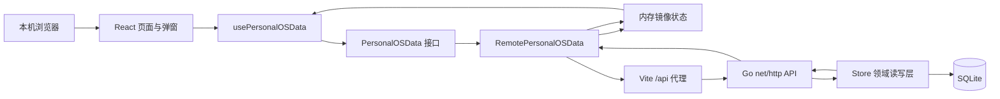
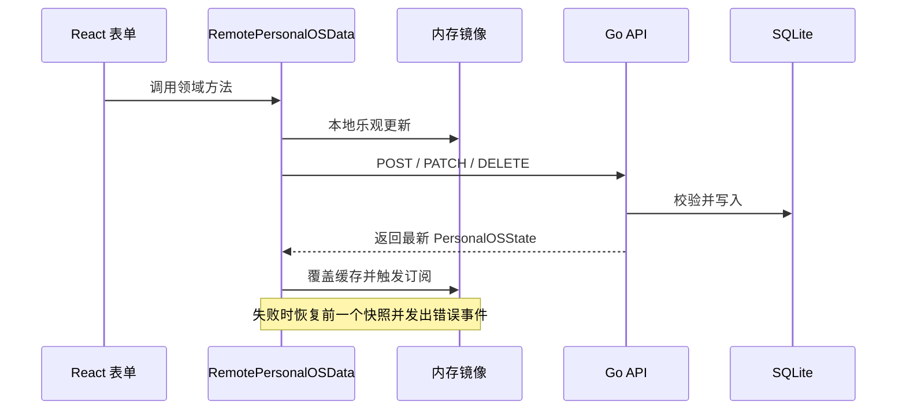

# Personal OS 当前实现总览

> 记录基线：2026-09-18。本文描述当前已实现的前端、后端、数据库、测试和运行方式，不描述历史方案演进。

## 目录

1. [产品与技术](#产品与技术)
2. [架构与数据流](#架构与数据流)
3. [前端实现](#前端实现)
4. [数据契约](#数据契约)
5. [Go 后端](#go-后端)
6. [HTTP API](#http-api)
7. [SQLite 数据库](#sqlite-数据库)
8. [账单导入](#账单导入)
9. [测试与质量](#测试与质量)
10. [运行与运维](#运行与运维)
11. [当前限制](#当前限制)
12. [维护约定](#维护约定)

## 产品与技术

Personal OS 是本机单用户个人管理系统，只运行在当前设备的 WSL 环境中。系统没有登录、多租户、公网部署、云同步或跨设备访问；SQLite 是唯一权威数据源。

| 页面 | 内部标识 | 当前定位 |
| --- | --- | --- |
| 概览 | `overview` | 汇总任务、记账、锻炼、学习和生活状态 |
| 计划 | `plan` | 任务流水、时间分组、筛选和完成管理 |
| 锻炼 | `health` | 训练、月度热力图、动作计划和身体指标 |
| 记账 | `finance` | 流水、预算、订单、周期账单和账单导入 |
| 学习 | `learning` | 多平台课程、课时、流水、笔记和周复盘 |
| 工作台 | `workbench` | 个人项目状态、摘要和行动管理 |

界面命名与数据标识分离：页面显示“锻炼”“记账”，数据域保留 `health`、`finance` 等历史标识。

| 层 | 技术 | 说明 |
| --- | --- | --- |
| 前端 | React 19、TypeScript、Vite 8 | 组件页面、弹窗、开发服务和生产构建 |
| 状态 | `useSyncExternalStore` | 订阅 `PersonalOSData` 的状态快照 |
| 样式 | 原生 CSS | 支持字号档位和减少动态效果 |
| 测试 | Vitest、Testing Library、jsdom | 组件、集成、工具和数据层测试 |
| 后端 | Go 1.22、`net/http` | 按领域拆分 API handler 和 Store |
| 数据库 | SQLite、`modernc.org/sqlite` | 纯 Go 驱动，数据库保存在 WSL 项目内 |
| 标识 | `github.com/google/uuid` | 业务主键使用 UUID 文本 |

| 服务 | 地址 |
| --- | --- |
| Vite 前端 | `http://localhost:5173` |
| Go API | `http://127.0.0.1:8787` |
| Vite 代理 | `/api` → `http://127.0.0.1:8787` |

## 架构与数据流



关键点：

- 页面组件不直接调用 `fetch`，只调用 `PersonalOSData` 方法。
- `RemotePersonalOSData` 是默认前端数据源，内部用 `createLocalPersonalOSData` 维护内存镜像。
- 内存镜像不是 localStorage 业务数据源；浏览器存储只保留在本地数据层实现和测试能力中。
- 多数写操作成功后返回最新完整 `PersonalOSState`，前端用服务端状态覆盖镜像。
- SQLite 是权威数据源，刷新或重启后仍从数据库加载。



错误处理：请求失败时恢复前一个快照；未注入 `onRequestError` 时派发 `personal-os:data-error`；`App.tsx` 显示中文 Toast。账单导入先返回导入结果，再重新读取完整状态。

## 前端实现

### 应用壳与通用组件

`src/App.tsx` 提供左侧主菜单、顶栏、移动端抽屉、快速记录、领域选择弹窗、设置抽屉和 Toast。全局字号 `default / large / xlarge` 和 `reducedMotion` 写入 `document.documentElement.dataset`。

“快速记录”入口行为：

| 当前页面 | 行为 |
| --- | --- |
| 概览 | 先选择领域，再打开对应弹窗 |
| 计划 | 打开任务标签 |
| 锻炼 | 打开训练标签 |
| 记账 | 打开收支标签 |
| 学习 | 打开学习记录标签 |
| 工作台 | 打开项目表单 |

| 组件 | 能力 |
| --- | --- |
| `RecordDialog` | 桌面居中、移动端底部抽屉、遮罩、`Escape`、焦点管理和滚动锁定 |
| `ConfirmDialog` | 删除前确认，支持取消、确认、焦点和错误语义 |
| `SettingsDrawer` | 右侧抽屉，管理显示偏好、锻炼周目标和记账分类 |
| `Toast` | 显示保存、更新、删除或错误提示 |

可读文本最小 14px；删除必须经过确认框。

### 页面能力

**概览页**是展示型仪表盘，包含今日重点、任务、财务、锻炼、学习和生活脉搏摘要。任务可直接完成、编辑、删除；编辑任务复用计划弹窗并预填数据。

**计划页**使用主流水加节奏面板。任务按逾期、今天、明天、本周后续、未排期和已完成分组；支持分类、状态、时间范围和关键词筛选。每条任务可完成、编辑、删除，摘要展示今天、本周和完成率。

**锻炼页**提供月份选择器、力量/有氧区分、月历热力图和训练流水。训练类型支持臀、腿、肩、胸、背、有氧多选；计划、热身、备注和动作标签完整展示。身体指标包含睡眠、体重、状态、月经流量、多选症状和备注。训练与指标均可编辑删除，指标按日期唯一。旧模型保留 `push / pull / rest`，新记录使用可选择类型。

**记账页**按日期倒序分组展示流水，支持类型、来源和关键词筛选。交易类型为支出、收入、转账；标签为普通、订阅、分期、退款。退款收入可关联原支出。订单展示预计总额、已付、未付、进度和定金/尾款/全款阶段。周期账单支持周、月、年，可启停、记录和删除。设置抽屉维护收支分类，删除分类不影响历史交易。

**学习页**支持 B 站、MOOC、伯索云、小鹅通、百度网盘和其他平台；链接识别只解析 URL，不发起网络抓取。系统覆盖路径、课程、课时、学习流水、文件夹、Markdown 笔记、标签、课程/课时关联和周复盘。课时支持单条和批量添加、状态更新、预计时长和链接。继续学习优先推荐最近学习且未完成的课时；周复盘按周起始日期唯一。

**工作台页**管理项目名称、目标、状态、下一步动作和截止日期。状态为 `planned / active / blocked / done`，支持完整 CRUD、状态切换和项目摘要。

### 工具层

`finance.ts` 计算财务摘要；`billImport.ts` 解析账单；`health.ts` 与 `healthViews.ts` 组装锻炼视图；`workoutPlanText.ts` 和 `workoutPlanTags.ts` 解析训练计划与动作标签；`learningSource.ts` 识别学习链接；`learningViews.ts` 和 `study.ts` 汇总学习进度；`planViews.ts` 分组筛选任务；`settings.ts` 提供默认设置。

## 数据契约

`src/data/model.ts` 定义共享语义。`PersonalOSState` 包含：

| 状态组 | 字段 |
| --- | --- |
| 计划与工作台 | `tasks`、`projects` |
| 记账 | `transactions`、`monthlyBudgetCents`、`paymentOrders`、`recurringTransactions`、`billImports` |
| 学习 | `studyLogs`、`learningPaths`、`learningResources`、`learningLessons`、`learningNoteFolders`、`learningNotes`、`weeklyReviews` |
| 锻炼 | `workouts`、`healthMetrics` |
| 设置 | `settings` |

默认设置为周锻炼目标 `4`、字号 `default`、减少动态效果 `false`；支出分类为餐饮、交通、购物、住房、订阅、其他；收入分类为工资、奖金、理财、其他。

核心枚举：

| 枚举 | 值 |
| --- | --- |
| 任务分类 | `work / health / learning / life` |
| 项目状态 | `planned / active / blocked / done` |
| 交易类型 | `expense / income / transfer` |
| 交易标签 | `normal / subscription / installment / refund` |
| 支付阶段 | `deposit / final / full` |
| 账单来源 | `manual / alipay / wechat` |
| 周期频率 | `weekly / monthly / yearly` |
| 学习平台 | `bilibili / mooc / plaso / xiaoe / baiduPan / other` |
| 学习状态 | `todo / doing / done` |
| 训练类型 | `glutes / legs / shoulders / chest / back / cardio`；兼容 `push / pull / rest` |
| 训练状态 | `planned / completed / skipped` |
| 身体状态 | `great / good / fair / tired` |
| 字号 | `default / large / xlarge` |

金额统一使用整数分：`¥12.50` 是 `1250`，预算字段为 `monthlyBudgetCents`。

## Go 后端

入口 `server/cmd/personal-os/main.go` 支持以下参数：

| 参数 | 默认值 | 说明 |
| --- | --- | --- |
| `--db` | `data/personal-os.db` | SQLite 路径 |
| `--migrate-only` | `false` | 迁移后退出 |
| `--backup` | 空 | 创建备份后退出 |
| `--addr` | `127.0.0.1:8787` | HTTP 监听地址 |

启动流程为打开数据库、迁移、按需进入迁移/备份模式，否则启动 HTTP 服务；收到 `SIGINT` 或 `SIGTERM` 后在 5 秒上下文内优雅关闭。

| 模块 | 职责 |
| --- | --- |
| `internal/api/api.go` | 路由、安全中间件、状态、任务、项目和设置 |
| `internal/api/finance_api.go` | 记账、订单、周期账单和导入 |
| `internal/api/learning_api.go` | 学习领域全部 handler |
| `internal/api/workout_api.go` | 训练和身体指标 |
| `internal/model/types.go` | 后端模型 |
| `internal/store/*.go` | SQLite 读写、事务、校验、迁移和备份 |

安全中间件要求：

1. `Origin` 只允许 HTTP 的 `localhost`、`127.0.0.1`、`::1`。
2. 非法 Origin 返回 `403 forbidden_origin`。
3. 非 `GET / HEAD / OPTIONS` 必须带 `X-Personal-OS-Client: local`。
4. 存在 Origin 时回显 CORS Origin 并设置 `Vary: Origin`。

Store 层负责打开数据库、执行迁移、读取完整状态、在事务中校验和写入、生成 UUID、维护时间和排序字段。多数写操作返回完整状态；资源不存在返回 404，输入非法返回 400，校验错误使用中文文案。

删除语义保留衍生记录并清理悬空关联：

| 删除对象 | 行为 |
| --- | --- |
| 支付订单 | 交易保留，`order_id` 置空 |
| 周期账单 | 已生成交易保留，`recurring_id` 置空 |
| 退款原支出 | 保留退款，清空退款关联 |
| 学习路径 | 课程、课时、流水保留，路径关联置空 |
| 课程 | 课时级联删除，流水和笔记保留并清空关联 |
| 课时 | 流水和笔记保留并清空课时关联 |
| 笔记文件夹 | 笔记保留并改为未分类 |
| 导入批次 | 删除映射和该批次生成的交易 |

## HTTP API

业务接口统一使用 `/api` 前缀。未特别说明时，写接口成功返回最新完整 `PersonalOSState`。

```text
GET    /api/state
POST   /api/quick-task
POST   /api/tasks
POST   /api/tasks/{id}/toggle
PATCH  /api/tasks/{id}
DELETE /api/tasks/{id}

POST   /api/projects
PATCH  /api/projects/{id}
PATCH  /api/projects/{id}/status
DELETE /api/projects/{id}

PATCH  /api/settings
PATCH  /api/settings/budget
POST   /api/settings/categories/rename

POST   /api/transactions
PATCH  /api/transactions/{id}
DELETE /api/transactions/{id}
POST   /api/recurring-transactions
PATCH  /api/recurring-transactions/{id}/status
POST   /api/recurring-transactions/{id}/record
DELETE /api/recurring-transactions/{id}
POST   /api/payment-orders
PATCH  /api/payment-orders/{id}
DELETE /api/payment-orders/{id}
POST   /api/bill-imports
DELETE /api/bill-imports/{id}

POST   /api/study-logs
PATCH  /api/study-logs/{id}
DELETE /api/study-logs/{id}
POST   /api/learning-paths
PATCH  /api/learning-paths/{id}
DELETE /api/learning-paths/{id}
POST   /api/learning-resources
PATCH  /api/learning-resources/{id}
PATCH  /api/learning-resources/{id}/status
DELETE /api/learning-resources/{id}
POST   /api/learning-lessons
POST   /api/learning-resources/{id}/lessons
PATCH  /api/learning-lessons/{id}
PATCH  /api/learning-lessons/{id}/status
DELETE /api/learning-lessons/{id}
POST   /api/learning-note-folders
PATCH  /api/learning-note-folders/{id}
DELETE /api/learning-note-folders/{id}
POST   /api/learning-notes
PATCH  /api/learning-notes/{id}
DELETE /api/learning-notes/{id}
POST   /api/weekly-reviews
PATCH  /api/weekly-reviews/{id}
DELETE /api/weekly-reviews/{id}

POST   /api/workouts
PATCH  /api/workouts/{id}
PATCH  /api/workouts/{id}/status
DELETE /api/workouts/{id}
POST   /api/health-metrics
PATCH  /api/health-metrics/{id}
DELETE /api/health-metrics/{id}

GET    /healthz
```

补充语义：

- `POST /api/tasks/{id}/toggle` 切换任务完成状态。
- `POST /api/settings/categories/rename` 重命名支出或收入分类。
- `POST /api/transactions` 可创建或关联支付订单。
- `POST /api/bill-imports` 返回导入数量、重复数量和批次 ID，随后前端重新获取状态。
- `POST /api/learning-lessons` 和 `POST /api/learning-resources/{id}/lessons` 都用于批量添加课时。
- `POST /api/weekly-reviews` 对同一周起始日期做覆盖保存。
- `POST /api/health-metrics` 创建或按日期覆盖身体指标。
- `GET /healthz` 返回 `{"status":"ok"}`。

## SQLite 数据库

默认数据库路径：

```text
/home/xqx/project/personal-os/server/data/personal-os.db
```

数据库与备份目录不进入 Git。

| 迁移 | 作用 |
| --- | --- |
| `0001_init.sql` | 创建 `settings`、`tasks`、`projects` |
| `0002_domain_tables.sql` | 增加预算；创建记账、学习、锻炼领域表 |
| `0003_allow_zero_workout_duration.sql` | 重建训练表，允许训练时长为 0 |
| `0004_default_monthly_budget.sql` | 将不大于 0 的历史预算改为 `100000` 分 |

| 表组 | 表 |
| --- | --- |
| 全局 | `settings` |
| 计划与工作台 | `tasks`、`projects` |
| 记账 | `payment_orders`、`transactions`、`recurring_transactions`、`bill_imports`、`bill_import_transactions` |
| 学习 | `learning_paths`、`learning_resources`、`learning_lessons`、`study_logs`、`learning_note_folders`、`learning_notes`、`learning_note_tags`、`weekly_reviews` |
| 锻炼 | `workouts`、`workout_kinds`、`workout_exercises`、`health_metrics` |

关键约束：

- 身体指标 `date` 唯一。
- 周复盘 `week_start_date` 唯一。
- `transactions` 的 `source + source_trade_no` 非空时唯一。
- 交易金额必须大于 0；订单预计总额不能小于 0。
- 周期账单只允许支出或收入，频率只允许周、月、年。
- 训练时长允许 0；睡眠时长不能小于 0。

主键为 UUID 文本；日期为 `YYYY-MM-DD`；时间戳为 ISO 文本；数组和标签使用 JSON 文本或子表。

## 账单导入

账单导入完全发生在本机浏览器，不接入支付宝或微信 API，也不上传账单文件。

| 项 | 当前能力 |
| --- | --- |
| 文件 | `.csv`、`.xls`、`.xlsx` |
| 来源 | 支付宝、微信 |
| 编码 | UTF-8 和常见中文 CSV 编码自动回退 |
| 预览 | 必须预览，可取消勾选，可修改分类、方向和备注 |
| 去重 | 优先交易订单号/单号；缺失时用来源、时间、对方、金额和方向生成指纹 |
| 撤销 | 按批次删除生成交易，不影响手动记录 |

方向映射：

| 输入语义 | 行为 |
| --- | --- |
| 支出 | `expense` |
| 收入 | `income` |
| 收入 + 退款 | `income`，标记 `refund` |
| 不计收支、转账、红包、提现 | 按转账处理 |
| 交易关闭、已撤销等失败状态 | 预览说明，默认不导入 |
| 无法识别方向 | 预览警告，默认不导入 |

不支持带密码 ZIP、截图、扫描件、PDF、OCR 和自动登录平台下载。

## 测试与质量

截至记录基线，前端测试为 18 个测试文件、103 个测试，覆盖通用弹窗、概览、计划、记账、锻炼、学习、工作台和远端数据层。后端测试覆盖空状态、安全策略、各领域 CRUD、中文校验、删除关联、导入撤销和备份。

| 测试文件组 | 覆盖 |
| --- | --- |
| `api_test.go` | 安全、状态、任务、项目、设置和错误格式 |
| `finance_api_test.go` | 交易、订单、周期账单、导入、撤销、分类和校验 |
| `learning_api_test.go` | 路径、课程、课时、流水、笔记、周复盘和删除语义 |
| `workout_api_test.go` | 训练、动作、指标、状态、编辑删除和校验 |
| `store/state_test.go` | 状态初始化、领域读取和关联语义 |
| `store/backup_test.go` | SQLite backup API |

基线命令：

```bash
go test ./...
npm run test
npm run build
npm run lint
```

生产构建会出现主 bundle 超过 500 kB 的 Vite 警告；这是已知优化项，不是失败。

## 运行与运维

| 命令 | 作用 |
| --- | --- |
| `npm run dev` | 只启动 Vite |
| `npm run dev:server` | 只启动 Go API |
| `npm run dev:local` | 安装依赖、迁移并启动前后端 |
| `npm run db:migrate` | 只执行迁移 |
| `npm run backup` | 创建 SQLite 时间戳备份 |
| `npm run test` | 运行 Vitest |
| `npm run build` | TypeScript 和 Vite 生产构建 |
| `npm run lint` | 运行 oxlint |

推荐流程：

```bash
npm run dev:local
```

然后访问 `http://localhost:5173`。健康检查：

```bash
curl http://127.0.0.1:8787/healthz
```

`npm run backup` 默认写入 `server/backups/personal-os-<UTC 时间戳>.db`，可传入目标路径。备份使用 SQLite backup API，而不是直接复制正在写入的数据库文件。

`scripts/install-go-wsl.sh` 安装 Go 1.23.4，可用 `PERSONAL_OS_GO_VERSION` 覆盖，支持 `x86_64` 和 `aarch64/arm64`。`scripts/dev-local.sh` 依次设置 Go 路径、安装依赖、迁移、后台启动 API、前台启动 Vite，退出时停止 API。

## 当前限制

| 限制 | 影响 |
| --- | --- |
| 单机单用户 | 不能跨设备访问，无账号和权限模型 |
| 无登录鉴权 | 依赖回环地址、Origin 和固定客户端头 |
| 完整状态返回 | 每次写入刷新完整状态，无分页和增量同步 |
| 前端复杂统计 | 部分汇总基于前端全量状态计算 |
| 主 bundle 偏大 | 生产 JavaScript 超过 500 kB |
| 批量能力有限 | 无批量编辑、批量删除、回收站和普通删除撤销 |
| 账单导入有限 | 不支持 PDF、截图、OCR、加密 ZIP 和平台自动下载 |
| 无提醒服务 | 无系统通知、后台调度或到期提醒 |
| 无 AI 能力 | 尚未实现总结、解释或自然语言查询 |
| 无自动云端备份 | 只有手动本地备份脚本 |

## 维护约定

1. SQLite 是唯一业务权威数据源，不要重新引入浏览器存储作为业务源。
2. 界面使用“锻炼”“记账”，代码可保留 `health`、`finance` 标识。
3. 修改数据模型时同步更新 `src/data/model.ts`、本地数据层、`server/internal/model/types.go`、Store、迁移和测试。
4. 新写操作保持“校验 → 事务写入 → 返回最新状态”。
5. 用户创建的记录必须有编辑和删除；删除必须确认。
6. 删除主体时保留衍生记录，只清理悬空关联。
7. 破坏性字段变更新增迁移，不重写旧迁移。
8. 行为变化后运行 Go 测试、前端测试、构建和 lint。
9. 新交互覆盖键盘可达性、错误提示、移动端布局和 14px 最小字号。
10. 接口、表名、命令和测试数量变化时同步更新本文。
