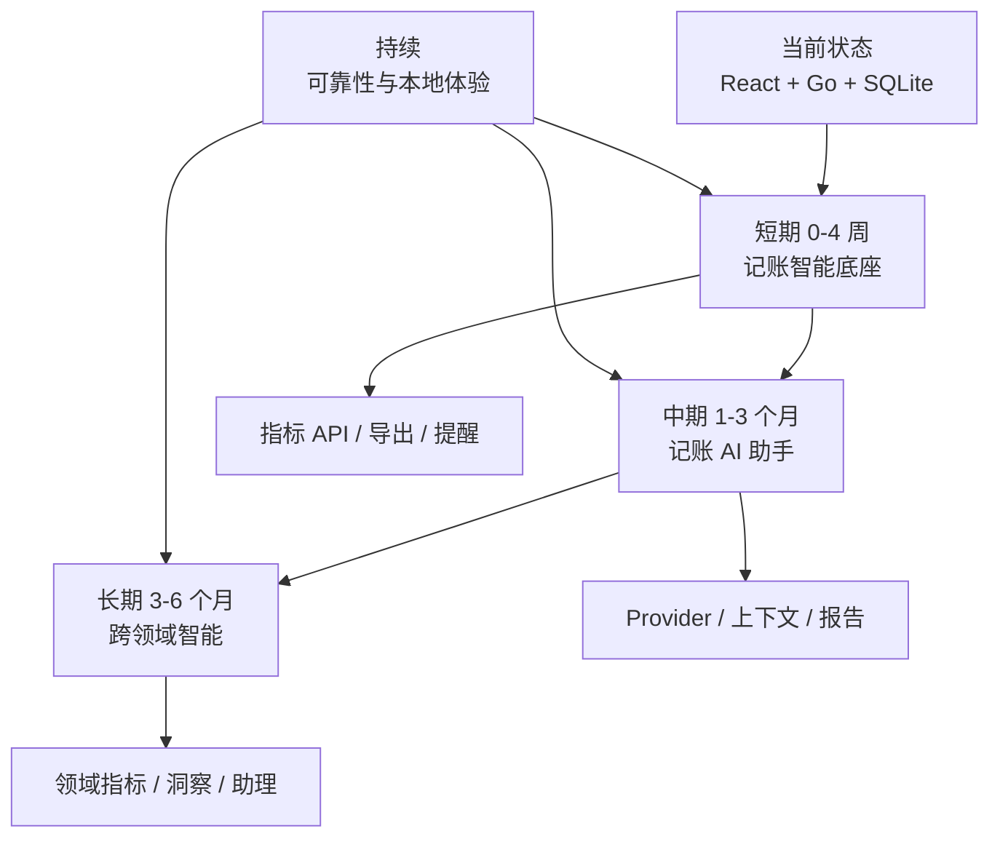
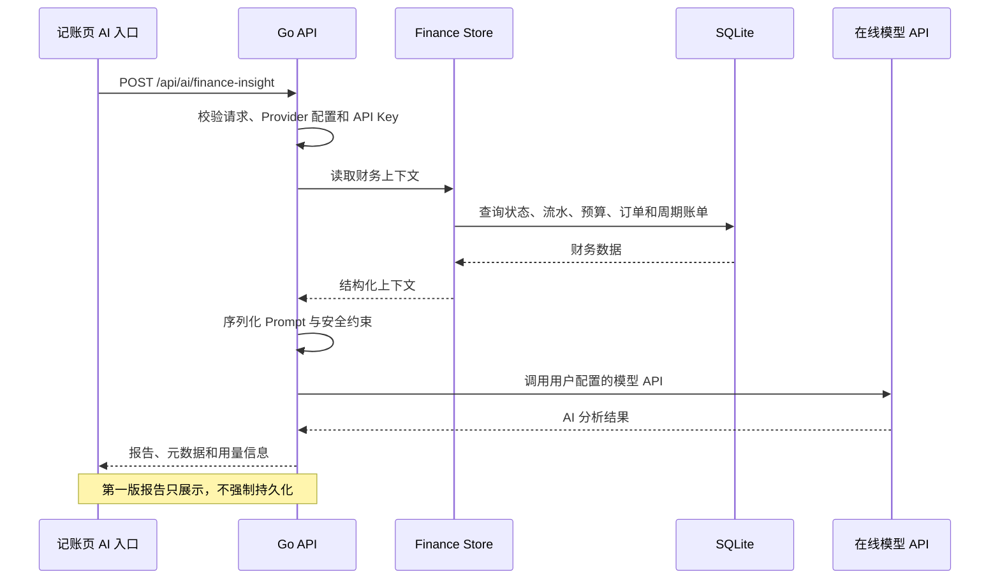

# Personal OS 后续发展方向路线图

> 记录基线：2026-09-18。本文基于 `docs/current-implementation.md` 描述的当前实现，规划本机单机产品的三层发展方向。

## 目录

1. [产品边界](#产品边界)
2. [当前基础](#当前基础)
3. [发展方向优先级](#发展方向优先级)
4. [路线总览](#路线总览)
5. [短期：0-4 周，记账智能底座](#短期0-4-周记账智能底座)
6. [中期：1-3 个月，记账 AI 助手](#中期1-3-个月记账-ai-助手)
7. [长期：3-6 个月，跨领域智能与本地体验](#长期3-6-个月跨领域智能与本地体验)
8. [AI 安全与风险控制](#ai-安全与风险控制)
9. [技术债与前置工程](#技术债与前置工程)
10. [验收标准](#验收标准)
11. [维护方式](#维护方式)

## 产品边界

Personal OS 继续坚持本机单机形态：

| 边界 | 决策 |
| --- | --- |
| 运行位置 | 只在当前电脑和 WSL 环境运行 |
| 访问方式 | 只使用本机浏览器访问 `localhost:5173` |
| 服务暴露 | Go API 继续只监听 `127.0.0.1:8787` |
| 账号系统 | 不引入注册、登录、多用户和租户 |
| 数据库 | SQLite 继续作为唯一权威数据源 |
| 云同步 | 不做多设备同步、云端主数据和自动上传 |
| 公网部署 | 不做公网服务、反向代理暴露或远程访问 |

AI 助手是这个边界中的例外能力，而不是部署边界变化：

- 应用本体和数据库仍只在本机运行。
- 用户主动触发分析时，Go 后端调用用户配置的在线模型 API。
- API Key 保存在本机环境变量或本机配置文件，不写入 SQLite，不下发给前端。
- 第一版允许读取全部 SQLite 数据构造 AI 上下文。
- 不通过 AI 能力引入多设备访问、账号体系或云端持久化。

## 当前基础

当前系统已经具备适合发展领域智能的基础：

| 领域 | 已有数据 | 智能化潜力 |
| --- | --- | --- |
| 记账 | 交易、分类、预算、订单、周期账单、导入批次、退款关联 | 消费趋势、预算偏差、订阅风险、订单提醒、异常支出解释 |
| 学习 | 路径、课程、课时、学习时长、笔记、周复盘 | 学习闭环、课时完成预测、笔记关联、复盘摘要 |
| 锻炼 | 训练类型、动作、组次、时长、热身、备注、身体指标 | 频率热力、部位恢复、负荷趋势、睡眠和月经周期关联 |
| 计划 | 任务时间、分类、完成状态、逾期情况 | 逾期风险、日程密度、优先级建议 |
| 工作台 | 项目状态、截止日期、下一步动作 | 阻塞识别、截止提醒、阶段推进建议 |
| 全局 | 统一 `PersonalOSState`、SQLite、Go API、React 页面 | 跨领域指标、周报、自然语言查询和助理入口 |

当前也必须先承认以下约束：

- API 写操作返回完整状态，没有增量同步。
- 复杂统计目前主要在前端基于全量状态计算。
- 没有后台调度器和通知通道。
- 没有 AI Provider、Prompt 管理、AI 报告持久化和上下文长度控制。
- 生产 bundle 超过 500 kB。

## 发展方向优先级

| 优先级 | 方向 | 原因 |
| --- | --- | --- |
| P0 | 记账领域智能与 AI 助手 | 数据结构最完整，财务反馈价值直接，用户已确认作为首选 |
| P1 | 学习闭环智能 | 课程、课时、时长和笔记已经形成闭环，适合生成学习建议 |
| P2 | 锻炼与身体指标洞察 | 数据敏感度高，但训练恢复和周期关联价值明显 |
| P3 | 跨领域助理、周报和提醒 | 需要前三个领域的指标层稳定后再统一建模 |
| 持续 | 可靠性、导出、备份和性能 | 是领域智能和 AI 报告可长期信赖的前提 |

排序依据：

1. 用户决策价值：能否帮助用户更快理解并调整行动。
2. 数据完整度：当前字段和关联是否足以支撑解释。
3. 实现风险：是否需要大量模型、数据库或前端结构变更。
4. 隐私敏感度：外发上下文是否能被清晰控制和说明。
5. 架构侵入度：能否在现有 `PersonalOSState` 与 Go Store 上渐进演进。

## 路线总览



三层路线不是严格串行。底座工程可以与 P0 并行，但领域智能必须先依赖稳定的指标定义和测试数据。

## 短期：0-4 周，记账智能底座

### 目标

在不引入 AI 的前提下，把记账数据从“可浏览流水”升级为“可解释指标”。

### 1. 建立财务指标 API

新增只读接口：

```text
GET /api/insights/finance
```

建议返回：

| 指标组 | 内容 |
| --- | --- |
| 月度趋势 | 近 3、6、12 个月支出、收入、净现金流 |
| 分类分析 | 分类金额、占比、环比、同比、连续上升或下降 |
| 预算执行 | 月度预算、已用、剩余、日均可用量、超支风险 |
| 订阅与周期 | 活跃周期账单、月化成本、即将到期或记录日期 |
| 订单与分期 | 总额、已付、未付、进度、定金/尾款/全款状态 |
| 异常大额 | 超过个人阈值或明显偏离分类均值的交易 |
| 退款影响 | 退款金额、被冲减支出、净支出和未关联退款 |
| 导入健康度 | 成功导入、重复跳过、失败原因分布 |

实现原则：

- 统计在 Go Store 或专用查询层完成，前端不再重复做大范围聚合。
- 接口输入使用月份、时间范围和可选分类筛选。
- 输出结构保持纯数据，不把 AI 文案放进指标 API。
- 为每个指标补 Go 单元测试和空数据测试。

### 2. 优化记账页面展示

在现有流水列表之外增加分析视图：

- 月度支出和收入趋势。
- 分类排行和占比。
- 预算剩余与日均可用。
- 周期账单月化成本。
- 订单和分期进度。
- 大额交易列表。
- 退款冲减结果。

移动端优先使用单列堆叠；桌面端可复用现有“主流水 + 管理面板”的结构。

### 3. 周期账单与订单提醒

当前系统没有后台调度器，第一版提醒应保持本机、无守护进程：

| 提醒 | 触发时机 |
| --- | --- |
| 周期账单临近 | 打开记账页或概览页时计算 `nextDate` |
| 预算超支风险 | 打开页面时根据当前支出节奏计算 |
| 订单尾款 | 根据 `stage` 和订单进度提示未完成阶段 |
| 备份过旧 | 检查 `server/backups` 最新文件时间 |

短期不引入 cron 或系统通知；先使用页面内提示和摘要标记验证提醒规则。

### 4. 导出与备份增强

新增本机导出能力：

| 格式 | 用途 |
| --- | --- |
| JSON | 完整备份和程序化迁移 |
| CSV | 交易流水分析和外部表格处理 |
| Markdown | 月度财务摘要 |

备份增强：

- 显示最近备份时间。
- 提供备份目录打开说明。
- 支持备份文件名包含版本或日期。
- 在设置抽屉中加入备份入口和最近备份状态。

### 短期验收标准

- `GET /api/insights/finance` 对空库、单月、多月、退款、转账、订单和周期账单都有稳定输出。
- 前端分析视图与流水摘要一致，不存在同一指标两套口径。
- 大金额、千分位、退款和转账边界有测试。
- 导出文件只保存在用户选择的本机位置。
- `go test ./...`、`npm run test`、`npm run build`、`npm run lint` 全部通过。

## 中期：1-3 个月，记账 AI 助手

### 目标

在用户主动触发时，让在线模型读取本机 SQLite 财务上下文，生成可解释的消费分析、预算建议和行动清单。

### 总体架构



### 新增接口

```text
POST /api/ai/finance-insight
```

建议请求字段：

- `month`：分析月份，例如 `2026-09`。
- `range`：时间范围标识，第一版可用 `current-month`。
- `includeTransactions`：是否包含流水。
- `includeOrders`：是否包含订单。
- `includeRecurring`：是否包含周期账单。
- `question`：用户本次关注的问题。

建议响应字段：

- `report`：AI 输出的 Markdown 报告。
- `contextStats.transactionCount`：进入上下文的流水数量。
- `contextStats.approximateTokens`：上下文 token 估算。
- `contextStats.range`：实际分析范围。
- `provider.name` 和 `provider.model`：Provider 与模型显示名。
- `usage.promptTokens / completionTokens / totalTokens`：Provider 返回的用量。

实际字段以实施时的 Provider 响应为准，但必须避免把 API Key、系统提示全文或原始连接信息返回给前端。

### Provider 配置

使用本机配置，不创建云端配置中心：

| 配置 | 来源 | 说明 |
| --- | --- | --- |
| Provider 名称 | 环境变量或本机配置文件 | 例如兼容 OpenAI Chat Completions 的服务 |
| Base URL | 环境变量或本机配置文件 | 便于切换官方或自建兼容网关 |
| API Key | 环境变量或本机配置文件 | 只在后端读取，禁止入库和前端展示 |
| 模型名 | 环境变量或本机配置文件 | 用户可按费用和能力选择 |
| 温度 | 配置文件默认值 | 财务分析建议使用较低随机性 |
| 超时 | 配置文件默认值 | 防止前端长时间等待 |
| 最大输出 | 配置文件默认值 | 控制费用和长度 |

第一版可以只支持一种 OpenAI 兼容 Chat Completions 形态，避免过早抽象多家协议。

### SQLite 上下文序列化

用户已确认第一版允许 AI 读取全部 SQLite 数据。实现上仍应通过后端结构化序列化，而不是把数据库文件直接上传：

1. 后端读取当前 `PersonalOSState`。
2. 按固定版本序列化财务上下文。
3. 包含时间范围、流水、分类、预算、订单、周期账单、导入来源和退款关系。
4. 在请求确认界面显示“将读取全部本机 SQLite 数据”。
5. 用户确认后才发起在线请求。
6. 记录本次上下文规模和 approximate token 估算。

上下文应使用稳定 JSON 结构，避免模型把表格空白、本地 ID 或无关节面文案当作业务信号。

### Prompt 设计

系统 Prompt 应明确：

- 输入是本机个人财务数据。
- 只输出基于给定数据的解释，不编造不存在的交易。
- 区分事实、趋势推测和建议。
- 转账不计入收支。
- 退款冲减对应支出。
- 订单阶段不等于新的交易类型。
- 订阅和分期是记录标签，周期账单才是重复计划。
- 所有金额单位是分。
- 输出使用简体中文 Markdown。

报告结构建议：

1. 本月消费总结。
2. 分类异常与趋势解释。
3. 订阅和周期账单风险。
4. 订单/分期付款提醒。
5. 预算调整建议。
6. 下一步记录或行动建议。

### 前端交互

记账页新增 AI 分析入口：

| 状态 | 行为 |
| --- | --- |
| 未触发 | 显示明确按钮，不自动调用模型 |
| 确认 | 展示将读取全部 SQLite 数据和外发到已配置 Provider 的说明 |
| 加载中 | 显示进度、禁用重复提交、允许取消等待 |
| 成功 | 渲染 Markdown 报告和上下文统计 |
| 失败 | 显示中文错误、保留输入、支持重试 |
| 无配置 | 提示本机配置 Provider，不打开空白分析 |

第一版报告只展示和复制；保存 AI 报告留到结构稳定后实现。

### 中期验收标准

- 无 API Key 时返回明确中文配置错误，不崩溃、不显示密钥。
- 用户不确认时不发起在线模型请求。
- 相同数据和相同模型配置下，报告应围绕相同事实；不要把模型随机性当作数据库结果。
- 上下文超过模型限制时返回可理解的失败或自动缩小范围。
- Provider 超时、限流、鉴权失败和无效响应都有后端测试。
- 报告中的金额、分类和周期账单结论能追溯到输入上下文。
- 应用仍无账号、无云同步、无公网部署。

## 长期：3-6 个月，跨领域智能与本地体验

### 1. 领域指标层

把短期财务指标经验泛化为统一指标层：

| 指标域 | 示例 |
| --- | --- |
| 财务健康 | 储蓄率、预算稳定性、订阅占比、分期压力、异常大额 |
| 学习完成度 | 课时完成率、连续学习天数、路径推进速度、复盘频率 |
| 锻炼节奏 | 周训练达成率、有氧/力量比例、部位间隔、恢复指标 |
| 任务风险 | 逾期数量、逾期时长、未排期比例、分类失衡 |
| 工作台健康 | 阻塞项目占比、临近截止、长期无推进项目 |
| 生活节奏 | 睡眠、体重、任务密度和锻炼负荷的联动 |

建议新增内部领域模块：

```text
server/internal/insights
```

只读查询从 Store 复用，指标输出由独立服务计算，避免继续膨胀单个 store 文件。

### 2. 学习闭环智能

在 P0 完成后扩展学习领域：

- 根据课时状态和近 7 天学习时长推荐下一步课程。
- 识别长期未推进的课程和路径。
- 从课程、课时和笔记生成阶段性学习摘要。
- 将周复盘与学习流水对照，指出复盘里提到但缺少记录的主题。
- 为多平台课程建立统一“继续学习”优先级。

### 3. 锻炼与身体指标洞察

锻炼数据更敏感，应在用户可解释的规则基础上推进：

- 训练频率与周目标达成率。
- 力量与有氧比例。
- 同一部位训练间隔。
- 训练时长、动作数量和备注强度变化。
- 睡眠、体重和训练后的状态关系。
- 月经流量和症状与训练记录的周期视角。

第一版使用统计和规则解释，不自动给出医疗建议；涉及身体异常时提示咨询专业人士。

### 4. Personal OS 助理

中期财务 AI 模块稳定后，抽象统一助理入口：

```text
POST /api/ai/assistant
```

能力分阶段提供：

| 能力 | 输入 | 输出 |
| --- | --- | --- |
| 自然语言查询 | 用户问题 | 相关状态摘要和解释 |
| 周报生成 | 时间范围 | 财务、学习、锻炼、任务和项目总结 |
| 跨领域建议 | 指标层输出 | 下一周关注点和行动清单 |
| 记录助手 | 用户意图 | 建议表单预填值，不直接静默写入 |
| 复盘助手 | 周期数据 | 成果、阻碍和下一步焦点草稿 |

助理不应跳过现有 `PersonalOSData` 和 API 校验直接改库。所有写操作仍由用户确认后走标准接口。

### 5. 本地体验增强

保持本机形态的同时改善日常入口：

| 方向 | 说明 |
| --- | --- |
| 桌面壳 | 后续评估 Wails 或类似方案，但不作为当前必要项 |
| 托盘 | 快速打开页面、触发备份、查看服务状态 |
| 本地通知 | 使用系统通知提醒账单、任务和备份 |
| 后台调度 | 仅在本机服务运行时调度，不引入云端任务 |
| 导入导出中心 | 统一支付宝、微信、CSV、JSON 和 Markdown |
| 插件化账单模板 | 允许用户定义列映射和方向规则 |
| 性能优化 | 拆分前端 chunk，减少大页面重复计算 |

## AI 安全与风险控制

### 数据外发

当前确认允许 AI 读取全部 SQLite 数据，但仍应提供清晰的运行时控制：

| 控制 | 要求 |
| --- | --- |
| 主动触发 | 不做后台自动分析或自动上传 |
| 明确确认 | 每次请求前展示数据范围和 Provider |
| 后端代理 | 前端不持有 API Key，不直接调用模型 |
| 范围显示 | 显示时间范围、交易数量和上下文规模 |
| 日志最小化 | 不在普通日志中打印原始个人数据 |
| 失败处理 | 不把完整请求体原样写入前端错误 |

后续可以增加敏感字段脱敏选项，但不应在第一版承诺中伪装为默认全量分析。

### Prompt 注入

账单对方、商品说明、备注、训练备注和学习笔记都是不可信文本。AI 上下文必须明确区分：

| 内容 | 信任级别 |
| --- | --- |
| 指标计算结果 | 可信，由程序计算 |
| 用户主动输入的问题 | 用户意图，但仍需校验操作权限 |
| 商户、备注、笔记、教练计划 | 不可信数据文本 |
| 模型输出 | 展示内容，不等于可执行指令 |

约束：

- AI 输出不能直接执行 SQL。
- AI 输出不能直接删除或修改记录。
- AI 建议的表单值必须由用户确认。
- 报告中的异常结论应附带可核对的记录数量、时间范围或 ID。

### 模型幻觉

- 使用结构化上下文和低随机性。
- 要求模型区分“数据事实”和“建议”。
- 财务计算先由本地指标 API 完成，模型负责解释，不负责作为唯一计算器。
- 对无法从上下文验证的结论要求模型标注“证据不足”。

### 费用与长度

- 显示 approximate token 估算。
- 设置最大上下文和最大输出。
- 失败重试使用退避，避免自动循环请求。
- 大数据量时先提示用户缩小范围。
- 不做后台批量分析。

## 技术债与前置工程

| 技术债 | 影响 | 建议时机 |
| --- | --- | --- |
| 全量状态刷新 | 状态变大后每次写入成本增加 | 财务指标 API 前先测量 |
| 前端复杂统计 | 同一规则可能重复实现 | P0 短期迁移到后端指标 |
| 主 bundle 超过 500 kB | 首屏和移动端加载变慢 | AI 页面引入前做代码分割 |
| 无后台调度 | 提醒只能页面触发 | 长期助理前评估本机调度 |
| 无通知通道 | 无法主动提醒备份或账单 | 本地体验增强阶段 |
| 无 AI Provider 层 | 无法安全管理 Key、超时和重试 | P0 中期第一项 |
| 无 AI 报告实体 | 报告无法追溯 | AI 报告结构稳定后 |
| 单文件 store 较大 | 领域继续增长后难维护 | 财务/学习/锻炼 insights 落地时拆分 |

## 验收标准

每个阶段完成前必须检查：

1. 数据边界不变：应用仍只在本机运行，SQLite 仍是唯一权威数据源。
2. 用户控制明确：AI 请求必须由用户主动触发并确认。
3. 指标口径一致：API、页面、导出和 AI 上下文使用同一套计算规则。
4. 错误可解释：配置缺失、网络失败、超时、限流和校验失败都有中文提示。
5. 测试齐全：新增 API、指标边界、AI 上下文和失败路径都有测试。
6. UI 可用：桌面和移动端不溢出、不重叠，最小字号保持 14px。
7. 隐私说明真实：文档和界面不夸大本地化能力，也不隐瞒在线外发范围。
8. 基线命令通过：

```bash
go test ./...
npm run test
npm run build
npm run lint
```

### 阶段验收

| 阶段 | 必须达成 |
| --- | --- |
| 短期 | 财务指标 API、页面分析视图、导出和备份提醒可用 |
| 中期 | 用户触发的记账 AI 报告可生成，Provider 配置和风险提示完整 |
| 长期 | 领域指标层、学习/锻炼洞察和跨领域助理入口可用 |

## 维护方式

1. 每个路线项先落一个小规模可验收版本，不合并无法验证的大改动。
2. 新指标先在 Go 层定义、测试，再进入页面。
3. AI Prompt、Provider 配置和上下文序列化必须带版本字段。
4. 领域分析不得绕过 Store 和 API 直接查询 SQLite。
5. 每次改变指标口径时更新文档和测试。
6. 每次引入新的外发数据范围时更新确认文案和隐私说明。
7. AI 相关代码独立成模块，避免散落在 React 组件里。
8. 每季度回顾一次 P0-P3 顺序，根据实际使用数据调整优先级。
